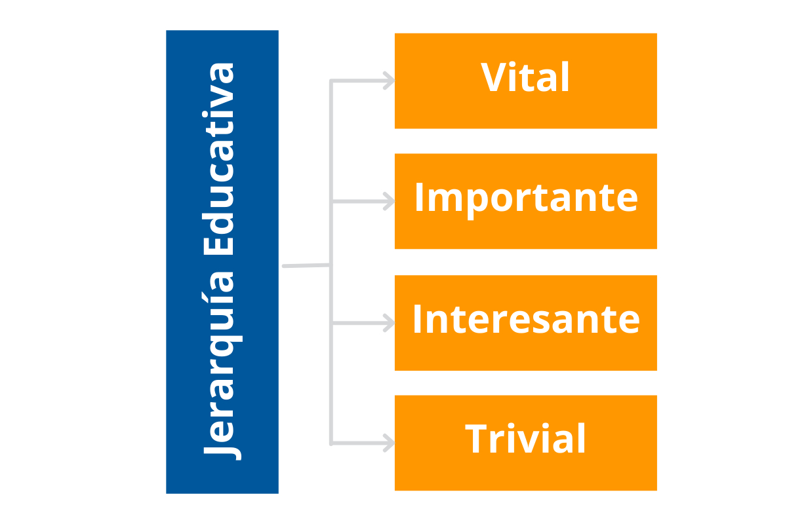
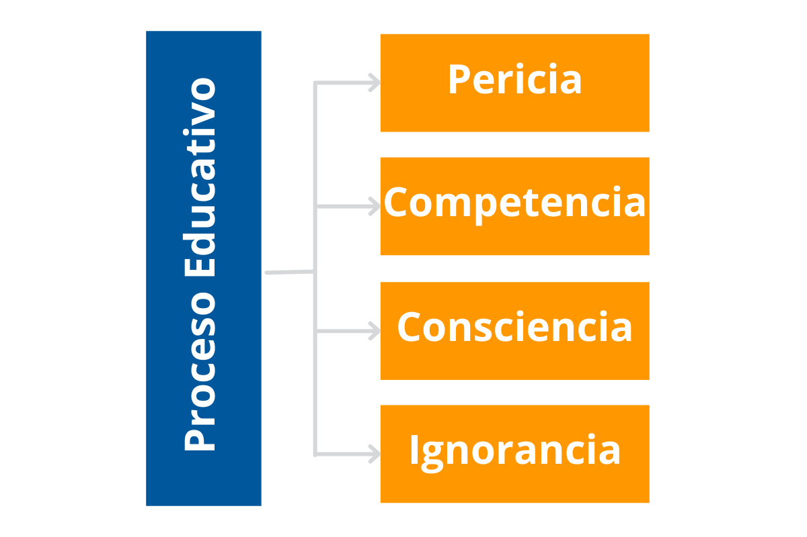
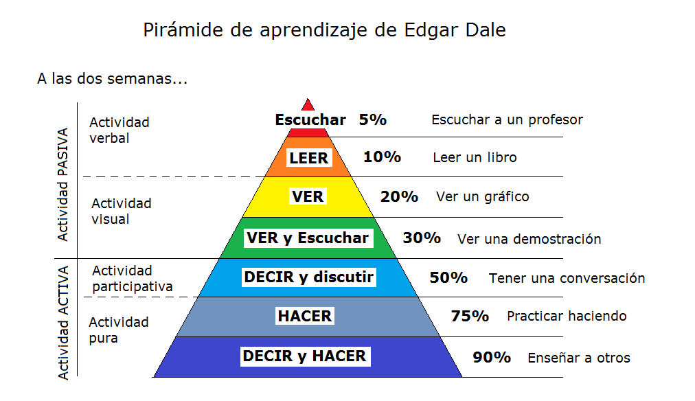

## ¿Cuáles son tus objetivos educativos?

Quiero que sepas que yo soy un estudiante, igual que tu. Deseoso de conocimiento que sea útil.

Me encanta el tiempo que paso con mis mentores y maestros, y sé que siempre habrá algo nuevo que aprender. Cuando las personas dicen que saben todas las respuestas, yo creo que pierden credibilidad desde un inicio. Porque el tema de las inversiones es tan vasto y siempre cambiante, que nadie puede saberlo todo.

Retirate Joven y Rico está aquí para ayudar a personas que son principiantes o personas que se ven a sí mismos como estudiantes con espacio para aprender y probablemente tu también estés en el mismo camino.

Cuando empecé a aprender sobre cómo invertir mi dinero, me cansé de ser sólo un seguidor. Dependía siempre del consejo de otros y no tenía la forma de determinar si ese consejo era bueno o malo.

Quería tomar decisiones inteligentes y contribuir en las discusiones con mis asesores en lugar de sólo hacer lo que me decían. Quería sentirme seguro. Tu también probablemente te sentirás de igual manera con tus responsabilidades financieras.

Vivimos en mundo cambiante. Las decisiones sobre tu futuro que te ves forzado tomar pueden ser escabrosas si no sabes mucho de inversiones.

Retirate Joven y Rico te ayudará a enfrentar tu futuro financiero con confianza. Te dará la seguridad de saber que siempre hay oportunidades para ti para obtener ganancias en cualquier tipo de mercado.

No dependerás de otros o de la dirección del mercado. Con [educación financiera](./3-tipos-de-educacion.mdx) vienen opciones, y con opciones viene la esperanza.

### Los consejos no son educación

A los expertos financieros les encanta decirnos qué es lo mejor para nuestro dinero, pero nunca parecen querer enseñarnos algo. Les gustan las relaciones disparejas. Mientras menos sepamos sobre cómo invertir nuestro dinero, más dependientes seremos de ellos. Quieren que estemos a se merced.

A los llamados “expertos” les gusta darte cantidad de consejos y opiniones. Pero los consejos son muy diferentes a la educación. El consejo te dice qué hacer, mientras que la educación te provee entendimiento real, entendimiento que te permite tomar tus propias decisiones.

> La educación es transformación

Tu tienes la oportunidad de escoger el camino de la educación y todas sus recompensas.

### La transformación es evidencia de educación real

Tu y yo tenemos el potencial de aterrizar un avión Jumbo 747. Podemos aprender a tocar un instrumento musical. Podemos aprender a cocinar un platillo gourmet. Tenemos el potencial de construir una casa o navegar un barco o hablar algún otro idioma. La lista es interminable.

Bajo este concepto, la idea de educación se traduce más allá de sólo transferir conocimiento del maestro al alumno. La verdadera educación es un proceso de transformación que cambia el “tengo potencial” a “me convertí en”.

> La educación es el proceso de darnos el poder de hacer algo que antes no podíamos hacer

## Contexto y contenido

Puesto simple, el **contexto** es el panorama general, y el **contenido** son los detalles. La información puede ser entendida de varias formas dependiendo del contexto.

Mientras más educación financiera adquieras, más convencido estarás de la importancia del contexto.

Lo que quiero decir es que mucha gente quiere que primero se les enseñe qué hacer antes de que se les enseñe cómo pensar.

Nuestro contexto es frecuentemente revelado por las preguntas que hacemos. Por ejemplo:

- Si tuvieras $100 mil, ¿en qué los invertirías?
- ¿Cuál es la última acción que compraste en la bolsa de valores?

Qué diferente sería si se preguntara:

- ¿Qué es lo que estás estudiando ahora?

- ¿Cuál fue el último curso de educación financiera al que asististe?

Las primeras dos preguntas muestran un contexto (o mentalidad) donde la clave para invertir tu dinero no es nada más que ponerlo en el lugar correcto. Mientras que las personas más inteligentes ven las inversiones en el contexto de ser un estudiante y aprender a invertir su dinero.

Cambiar de contexto significa mejorar nuestra perspectiva (el panorama). Estudiar el contenido significa expandir lo que sabemos (los detalles) y las instrucciones de cómo hacerlo.

### La jerarquía educativa

Es dicho que la belleza está en el ojo de quien la mira. Diría también que lo mismo aplica al valor. El valor de cierta información puede no tener precio para algunos y no tener valor para otros.

Alguna educación es importante para todos, como leer por ejemplo. No creo que haya muchos de nosotros que puedan alcanzar el éxito sin saber leer. Pero la importancia de la mayoría de la educación es más subjetiva de lo que se cree.

Lo que es vital para ti saber puede no tener importancia para otros. Depende de tus circunstancias y de tus objetivos.

Los sistemas educativos de los países tienen el poder de imponer sus opiniones sobre el resto de nosotros. Lo que se enseña en las escuelas está basado en lo que ellos piensan que tiene valor, y esas asunciones pueden no ser correctas para tus objetivos en tu vida.

Algunos de los temas que para los dirigentes de los sistemas educativos son importantes, no te sirven a ti para mejorar tu vida financiera. Se me viene a la mente la clase en el laboratorio de biología donde se disecciona una rana (no sé si en la actualidad se siga haciendo).

Los dirigentes educativos piensan que es vital para mí saber cómo diseccionar un rana. Y bueno, te lo digo yo, que soy una prueba viviente de que puedes tener una buena vida sin ser experto en cómo diseccionar una rana.

Ahora, si fuera a ser un biólogo, entonces sería una historia diferente. Podría ser **vital** entonces saber cómo diseccionar una rana. Pero eso es por mis circunstancias y mis objetivos, no por una dictadura burócrata.

A lo mejor alguna de la educación más vital que puedes recibir ni siquiera aparece en el radar de los sistemas educativos, pero es vital para tu vida financiera. Nunca tendrás una clase sobre cómo vivir una vida sin un trabajo. Nunca tendrás una clase sobre cómo funciona el mercado de valores. Sin embargo, millones de personas dependen del mercado de valores para tener un fondo para el retiro.

Evidentemente esos son tópicos sin importancia para los sistemas educativos, pero esos son temas de interés para ti y para mi.

¿Es esto un problema? No. No tienes que esperar a que alguien dicte lo que es **vital** para tu educación. No cuando eres un estudiante serio, porque ser un estudiante serio es ser un estudiante activo. Tu éxito financiero es demasiado importante para dejárselo a alguien más y su opinión de lo que es importante. Yo dejé de ser pasivo en cuanto a la educación se refiere mucho tiempo atrás.

Yo digo que ser un inversionista exitoso empieza con ser un estudiante serio. Esta es mi invitación para ti. Una invitación para desarrollar tu propia jerarquía educativa. Tu y yo somos ahora libres de los sistemas educativos. No tienes que ser forzado a estudiar lo que ellos dicen que es **vital** para ti. El valor está en el ojo de quien lo mira, y sólo tú tienes que decidir qué conocimiento es **vital** para ti.

Una vez que decidas qué es valioso para ti, todas tus oportunidades de educación pueden ser categorizadas en:

**No desperdicies tu tiempo en lo trivial.** Después sé consciente de no gastar mucho tiempo en lo que es meramente interesante. **Escoge enfocarte en lo importante y vital.** Aquí es donde puedes gastar mejor tu tiempo, tu esfuerzo y tu dinero.

Cuando establezcas tus **objetivos**, piensa sobre lo que estás aprendiendo en el contexto de la jerarquía educativa. Cuando lo hagas, encontrarás que lo que estudies tendrá mayor significado, mayor valor y más diversión.

Haz un listado de las clases que tomaste en la escuela y piensa en dónde encajan en tu jerarquía educativa y reflejan cuánto mucho o poco utilizas ese conocimiento cada día. Después haz un listado de lo que piensas necesitarás aprender para poder alcanzar los objetivos que tienes el día de hoy.

Las escuelas tradicionales tienden a enfocarse en lo que ellos frecuentemente se refieren como “educación general”. Los primeros dos años en una universidad típica usualmente incluyen aprender un poco de muchos temas, en lugar de aprender mucho de pocos temas. Es por eso que los primeros años de tu carrera te encuentras tomando clases con ingenieros, abogados, contadores cuando tu estudias historia del arte.

Esto nunca ha tenido sentido para mi. Puede que termines con una amplia cultura general, pero también terminas aburrido. Y sabes qué? Yo no quiero tener cultura general, yo quiero ser realmente bueno en invertir mi dinero. Si necesito diseccionar una rana contrataré un biólogo.

Es por eso que en Retirate Joven y Rico nos enfocamos sólo en cómo controlar tu destino financiero y prometemos no desperdiciar tu tiempo y dinero.

## El proceso educativo

Es necesario evaluar nuestro nivel de educación actual y determinar **objetivos vitales** relacionados con lo que queremos alcanzar y con nuestra transformación. Recuerda que la educación real transforma. Nos cambia.

Conforme te vayas involucrando más con Retirate Joven y Rico, irás avanzando en el proceso educativo. Tu contexto irá cambiando conforme evalúes dónde estás situado en el proceso educativo y con cada tema en tu educación financiera.

### Ignorancia

Ignorancia es simplemente algo de lo que no sabemos nada. Si eres ignorante en algo, no significa que seas tonto. Lo que te falte en inteligencia o talento lo puedes obtener con pasión y esfuerzo. El esfuerzo es el gran ecualizador.

La mayoría de la gente no tiene ni idea de la bolsa de valores porque es un tema que no se enseña en el sistema educativo tradicional. Date cuenta que eres una persona bastante inteligente, lo único que te hace falta es enfocar tu inteligencia en como invertir tu dinero.

Lo que hace peligroso invertir en activos de papel para la gente común, a diferencia de un negocio o los bienes raíces, es que cualquiera los puede comprar. Y mucha gente lo hace. Hay una barrera de entrada muy pequeña para entrar al mercado de valores.

Piensa en el sistema de retiro de tu país. En el mío, es un programa de contribución, donde parte del cheque de pago de todos los trabajadores es traspasado a los “expertos” de la industria financiera para que inviertan nuestro dinero en fondos de inversión.

La mayoría de todos los trabajadores no saben nada sobre el mercado de valores, los riesgos, las comisiones, las leyes, y ni siquiera los detalles básicos de una inversión. Como un rebaño de borregos, somos guiados hacia donde nos quieran llevar.

Sólo se necesita un poco de sentido común para salirse del rebaño y decir, “probablemente no debería invertir mi dinero en algo que no entiendo”. Pero evidentemente no hay suficientes personas “comunes” porque el rebaño crece y crece cada día.

Cuando perdemos dinero en una inversión, es probablemente porque hay algo que no entendemos. Cuando analizo mis ganancias y pérdidas, mis mayores pérdidas ocurrieron cuando me metí en algo que todavía no entendía.

La mayoría del dinero se pierde debido a la **ignorancia** más que nada. Afortunadamente tenemos el poder para salir de ella.

### Conciencia

Avanzar de la ignorancia a la **conciencia** es un buen sentimiento. Es iluminación, es descubrimiento, y es impresionante. Pero es imposible determinar objetivos educativos sólidos si no descubrimos primero un poco de lo que queremos aprender.

Recuerdo la primera vez que tomé mi primer curso sobre bienes raíces. Cuando conocí las ventajas de invertir en bienes raíces fue fabuloso. Fue asombroso descubrirlo. Pude ver que eso era algo que quería estudiar y aprender más.

Cuando tenemos momentos de descubrimiento simplemente aprendemos sobre lo que es posible. Conforme te vayas involucrando más con Retirate Joven y Rico tendrás más **conciencia** de lo que los inversionistas profesionales hacen. Las probabilidades son que quieras ahondar más y avanzar de simplemente **conciencia** a un nivel más profundo de entendimiento. Ese entendimiento se llama competencia.

### Competencia

Imagina un piloto de una aerolínea que ha aprobado su examen escrito sobre regulaciones aéreas, pero que no ha podido practicar lo que ha aprendido en el aire.

Imagínate a un músico que ha pasado muchos meses en un salón de clases aprendiendo a leer música, pero que todavía tiene que escoger un instrumento y practicar.

La **competencia** es ese nivel de entendimiento que todavía no se ha convertido en habilidad. **Competencia** denota la cantidad mínima de conocimiento y habilidad para desempeñar un acto.

En un juicio se espera que un testigo sea competente para testificar. Pero la competencia frecuentemente está asociada con mínimos. En la mayoría de los países existen exámenes de competencia mínima para varias licencias profesionales para practicar leyes o medicina.

Competencia denota la habilidad para sacar una “A” o un “10” en un examen escrito. Pero entender cómo se hace algo no es lo mismo que tener la habilidad para hacerlo.

El mundo real demanda pericia. Los salones de clase son paraísos de competencia. Los salones de clase premian la competencia. Puedes avanzar por toda tu vida académica con nada más que competencia.

Hay muy poco espacio para la competencia en el mundo real. El mundo real premia la pericia. Es mucho más fácil decir que hacer.

### Pericia

Estrechamente relacionada con la palabra competencia está **pericia**. La pericia es un grado mayor de competencia, y esa diferencia puede ser la diferencia entre hacer dinero y crear riqueza.

Si la competencia es la teoría, la pericia es la ejecución. La competencia es la ascensión intelectual a la verdad. La pericia es la ejecución.

En mi experiencia, la pericia es más una persecución que un destino. Siempre podemos adquirir más pericia. Espero que el próximo año tengas más pericia para invertir tu dinero que la que tienes hoy. Y que el año siguiente tengas aún más pericia que el próximo.

Conforme los mercados y las economías cambian, también tendrás la necesidad de cambiar tu base de conocimientos. No puedes conformarte sólo con competencia.

La gente se pregunta cuándo sabrán que pueden ya invertir su dinero exitosamente. Desconozco la respuesta porque la pericia es un proceso, no un evento. No existe un momento en particular en el que puedas decir ayer no sabía cómo invertir mi dinero y hoy ya lo sé. Sin embargo existen hitos. Llegará el día en que empieces a invertir pequeñas sumas de dinero, y luego vayas incrementando los montos y tus ganancias.

A través del tiempo te moverás a través del proceso educativo hasta alcanzar la pericia. Pero no podrás determinar cuándo ocurren esas transiciones. Existen miles y miles de inversionistas con mayor pericia que la que yo pueda alcanzar en mi vida, pero también probablemente habrá millones y millones que tengan menos pericia que yo.

### Confundir conciencia con pericia puede costarte mucho dinero

Parte del valor del proceso educativo es la humildad de saber que si eres un inversionista, también eres un estudiante. He visto a algunas personas dar el salto a la etapa de conciencia y confundirla con pericia.

Algunas veces esto ocurre por arrogancia, y otras simplemente por la emoción del descubrimiento. Si te mantienes verificando en qué paso del proceso educativo te encuentras te evitarás muchos dolores de cabeza y pérdida de dinero en el futuro.

## Sugerencias para convertirte en un gran estudiante

Estás listo para tomar control de tu educación y convertirte en un estudiante serio? Claro que lo estás! Eres de las personas que saben lo que quieren y qué captura tu interés. **Sabes lo que es vital para tu educación** y lo que es trivial.

Existe una gran diferencia entre “leer” y “estudiar”. Si te gusta la idea de convertirte en un estudiante serio, estas actividades para suplementar tu lectura te asegurarán una transformación más rápida y poderosa que sólo leer.

1. Discute lo que lees y compártelo con otros que compartan tus intereses.
2. Determina objetivos educativos, no sólo de nivel de vida o monetarios.
3. Empieza a trabajar con mentores.
4. ¡Hazlo ahora!

Recuerda, ahora eres un participante activo en tu aprendizaje. Mete tus experiencias propias, tus propias historias y tus propios ejemplos en tu aprendizaje.

### Comparte tus descubrimientos con otros

No necesitas ser un experto para compartir lo que vas descubriendo. Déjate emocionar por lo que vas aprendiendo. Comparte esa emoción y tu nuevo aprendizaje con alguien más.

Enseñar es una gran manera de aprender. Conforme vas leyendo, ten a la mano una pluma o lápiz para ir marcando lo que haga clic contigo o que sientas que necesitas revisar posteriormente.

Toma notas añadiendo tus propios pensamientos o ejemplos. Compartir estas notas con alguien más te ayudará a recordar lo que vas aprendiendo. Explicar conceptos a alguien más te ayudará a mantener las cosas simples y poner las ideas en tus propios términos y tus propios ejemplos e historias se afirmarán en tu cerebro.

Encontrarás que puedes recordar las cosas que lees y compartes mucho mejor que sólo leer y quedarte el conocimiento para ti mismo.

Revisa el [Cono del Aprendizaje](https://es.wikipedia.org/wiki/Edgar_Dale) desarrollado por Edgar Dale. Hace muchos años él descubrió que sólo **leer es la forma menos efectiva de aprender** algo nuevo.

Considera formar un grupo con dos o tres amigos que estén estudiando lo mismo que tu al mismo tiempo, y júntense para desayunar una vez a la semana para discutir lo que han aprendido.

### Revisa tus objetivos educativos ahora mismo

Al iniciar cualquier viaje es una buena idea establecer primero algunos objetivos. Es común tener objetivos para mejorar tu nivel de vida. Y es común también tener objetivos monetarios. Pero muy poca gente se establece objetivos educativos una vez que terminan la escuela.

#### Objetivos de nivel de vida

Estoy seguro que tu y yo siempre tendremos el deseo de mejorar nuestro nivel de vida. Todos tenemos eso en común.

- Quiero renunciar a mi trabajo
- Quiero una casa en la playa
- Quiero un carro deportivo
- Quiero viajar por el mundo
- Quiero ser libre financieramente
- Quiero ayudar y servir a otros

Ve y haz una lista de tus propios objetivos. No los objetivos de alguien más o que alguien te dijo que debes tener. Sino los objetivos que te harán feliz a ti. Escríbelos. Nadie los tiene que ver y no los tienes que justificar con nadie. Tu sabes por qué son importantes y eso es suficiente.

Escríbelos como el primer paso hacia el reconocimiento de que eres tú el que está en control de este viaje. Tú decides qué es vital y qué es trivial, desde tus objetivos hasta tu educación.

**Soñar es gratis**

Me sorprende a veces el poco tiempo que la gente le dedica a soñar. La gente se concentra más en sobrevivir que en hacer planes para tener abundancia. Las conversaciones que tiene la gente hoy sobre sus finanzas personales son más de cómo batallan para salir a flote que de sus planes para lograr sus objetivos.

Deja que tus sueños alimenten tu determinación y te llenen de energía. Los sueños desatan el poder de tu mente tanto consciente como subconsciente. Soñar hace que uno se sienta bien. Soñar es bueno.

Toma esos sueños y conviértelos en objetivos poniéndolos por escrito.

#### Objetivos monetarios

También podemos tener objetivos monetarios. Los objetivos monetarios son diferentes a los de nivel de vida. Pero los objetivos monetarios por sí solos tienden a perder poder. Son vagos y sin significado.

- Quiero $1,000,000
- Quiero $10,000 por mes
- Quiero estar libre de deudas

Para algunas personas, éstos son más deseos que objetivos. Pero los objetivos monetarios adquieren instantáneamente más significado cuando se derivan de tus objetivos de nivel de vida.

Tomemos como ejemplo el objetivo de tener $100,000 dólares. Por sí solo, $100,000 es sólo dinero. Pero si empezamos con un objetivo de nivel de vida, como comprarte el carro de tus sueños, de repente tu corazón empieza a latir más rápido y ese sueño empieza a tomar vida.

Puede que empieces visitando al distribuidor de la marca. Te puedes subir al carro, olerlo, sentirlo. Esto se convierte en una experiencia muy poderosa. Ahora preguntas al vendedor cuánto cuesta.

Cuánto dinero necesitas para convertir tu sueño en realidad? Si el precio es $119,900, ahora ya tienes un objetivo monetario con significado. En este punto puedes escoger comprarlo o ponerte un objetivo para incrementar tu flujo de efectivo para poder pagar $1,299 por mes. Ahora tu objetivo monetario es todavía más específico.

#### Objetivos educativos

Entonces cómo vas a incrementar tu flujo de efectivo en $1,299 por mes? La buena noticia es que **ganar esa cantidad extra cada mes es cuestión de educación y acción**.

Algunos pensarán que la única manera de ganar esa cantidad mensual es reduciendo sus gastos mensuales por esa cantidad. No sé tú, pero yo no estoy dispuesto a renunciar a nada en mi vida.

Pero hay otra manera. Una mejor manera. En lugar de reducir tus gastos, puedes decidir aprender cómo adquirir activos que generen flujo de efectivo que te proporcionarán esa cantidad extra cada mes.

Ahora ya tienes un objetivo educativo: aprender cómo adquirir activos que incrementen mi flujo de efectivo mensualmente.

## ¿Qué es la creación de riqueza?

En una palabra, la creación de riqueza es simplemente aprender cómo adquirir activos inteligentemente.

Estos activos vienen en múltiples formas:

1. Negocios
2. Bienes raíces
3. Activos en papel como acciones
4. Materias primas como oro o petróleo

Cuando uno mira a millonarios como Warren Buffett, Donald Trump o Carlos Slim, uno puede ver que pudieron amasar gran cantidad de riqueza porque **adquirieron la educación** necesaria para aprender a comprar activos.

Imagínate que se levantan en la mañana y se preguntan, “¿Dónde encontraré un activo que pueda comprar hoy?”. No necesitan el consejo de alguien. Más importante, no se sientan a esperar a que una gran oferta llegue a ellos. Saben cómo y dónde buscar una oportunidad y utilizan su conocimiento financiero para determinar si compran o no.

Si alguien con educación financiera quiere comprar un automóvil, no deja de comprar su café diario del Starbucks, ni empieza a guardar el cambio que le va sobrando en una cuenta de ahorro hasta que junte el dinero necesario. Tampoco lo firma con su tarjeta de crédito y cruza los dedos cada mes que tenga que hacer el pago mínimo. Y seguro tampoco se consigue un segundo empleo.

¿Qué puedes hacer entonces cuando quieres hacer realidad un objetivo de nivel vida?

- Crear un negocio que te genere $1,299 por mes... si es que tienes la educación y el conocimiento para crear y administrar un negocio.
- Adquirir una propiedad que te genere $1,299 por mes... si es que tienes la educación y el conocimiento en bienes raíces.
- Vender unas opciones de compra en la bolsa de valores que te generen $1,299 por mes... si es que tienes la educación y el conocimiento para invertir en la bolsa de valores.

Te puedes dar cuenta ahora que ganar un ingreso extra es simplemente un asunto de adquirir la educación financiera adecuada?

Conforme vayamos aprendiendo de las diferentes clases de activos, podremos escoger en cuál de ellos deseamos ahondar y aprender más. Después podremos determinar objetivos monetarios que estén relacionados con la adquisición de activos que nos permitan cumplir nuestros objetivos de nivel de vida.

Utilizamos objetivos educativos para cumplir objetivos monetarios que cumplirán objetivos de nivel de vida. Es una fórmula que ha funcionado a las personas más ricas del mundo. Y puede funcionar para ti.

### La educación te da poder

> Usa los objetivos educativos para alcanzar objetivos monetarios que cumplan tus objetivos de nivel de vida

Cuando piensas en esto, es sorprendente que una vez las personas terminan la universidad, frecuentemente en lo único en que se enfocan es en los objetivos de nivel de vida y monetarios.

La mayoría no tiene respuesta cuando se les pregunta sobre sus objetivos educativos porque nunca aprendieron a ser un participante activo en su educación.

### El mejor camino hacia la pericia es la mentoría

Si alguna vez viste la película _Karate Kid_, habrás visto una gran historia de cómo un mentor cambió para bien el contexto de su discípulo.

Todos conocemos la historia. O al menos eso creo. Se trata de la historia entre un mentor y su discípulo que se desarrolla cuando un chico común y corriente decide defenderse de los malosos de su vecindario.

El mentor decide entrenarlo, pero el chico se frustra casi inmediatamente con el método ortodoxo del maestro. Por qué? Porque el contexto del discípulo es muy diferente al del mentor. El cree que obtendrá el éxito aprendiendo a patear y a golpear. Pero su mentor, mucho más sabio que él, lo empieza a entrenar de manera muy diferente a lo que él esperaba.

El mentor tiene su contexto. El sabe que aprender karate es una tarea mucho más seria de lo que su discípulo cree. Se muestra como la ansiedad de un nuevo estudiante opaca su habilidad para pensar en un nivel más profundo.

Finalmente el chico descubrió y aprendió cosas fuera del salón de clases tradicional a través de métodos que nunca antes había visto o experimentado. Más importante, su contexto mejoró dramáticamente. No sólo aprendió karate, sino que también maduró. Su filosofía comenzó a cambiar. Su forma de ver el mundo empezó a cambiar y a mejorar.

El chico se transformó completamente. **La educación es transformación**.

No conozco un camino hacia la pericia más poderoso que cuando alguien con pericia te muestra el camino. Aunque no reconozcas el camino por el que transitan.

### La ceguera de la preocupación

Cuando quise empezar a invertir en bienes raíces todavía no había cambiado mi contexto. Estaba más enfocado en comprar que en aprender. Tenía el deseo de ser rico por lo que quería comprar activos desde el primer día, pero todavía no había mostrado el propio respeto para adquirir educación financiera. Como resultado, invertir al principio fue muy difícil.

Vi muchas casas y me frustré por la ceguera que la preocupación me causaba. Pareciera que no podía diferenciar una buena inversión de una mala. Cuando estaba a punto de cerrar un trato me empezaba a preocupar. Qué pasa si hay moho? Se ve bien, pero no sé nada sobre el moho. Qué tal si no la puedo rentar? Pero aún, qué tal si consigo un inquilino y destroza la casa? Por qué el dueño la quiere vender tan barata? Parece demasiado bueno para ser verdad, debe de haber una razón oculta por la que me la quiere vender.

¿Te ha pasado? Tenía un profundo deseo de adquirir activos, pero estaba cegado por las preocupaciones.

La fórmula ahí está y es muy sencilla. Compra la propiedad adecuada, rentala, siéntate y recolecta la renta. Repite hasta que seas rico.

Finalmente comprendí que lo que me faltaba era la educación financiera para poder determinar cuál era la propiedad adecuada. Fue entonces que en lugar de dedicar mi tiempo a buscar propiedades lo dediqué a buscar un mentor.

### El dinero no es problema

> El dinero viene con la educación financiera

No necesitas aceptar esta declaración ahora. Pero algún día te darás cuenta que **el dinero no es un problema, sólo deficiencia en la educación**. La falta de dinero siempre es secundario. Nunca es el principal problema.

Como inversionista encontrarás que los objetivos educativos son vitales porque es precisamente de la educación de donde el dinero viene.

Como la mayoría de la gente, caí muchas veces en la trampa de que mi problema era la falta de dinero. Recuerdo que cuando quería comprarme algo grande siempre pensaba que costaría más de lo que tenía. En este tipo de situaciones es fácil pensar que el problema es la falta de dinero.

Igualmente de peligrosa es la famosa frase:

> Se necesita dinero para hacer dinero

Es un completo mito que desafortunadamente frena a la mayoría de las personas de alcanzar sus objetivos monetarios. **El dinero no proviene del dinero, proviene de la educación financiera**.

Veamos nuevamente nuestros ejemplos de éxito financiero: Warren Buffett, Donald Trump y Carlos Slim. ¿Qué pasaría si perdieran todo su dinero y todos sus activos el día de hoy? ¿Qué pasaría si tuvieran que empezar nuevamente desde cero? Serían pobres o volverían a alcanzar el éxito nuevamente? Por supuesto que alcanzarían el éxito nuevamente. Es ridículo pensar que no lo harían.

Su poder radica en la educación financiera que tienen. Su éxito viene de lo que saben, no de lo que tienen.

Volvamos a la lista de objetivos de vida que la mayoría de la gente tiene:

- Quiero renunciar a mi trabajo
- Quiero una casa en la playa
- Quiero un carro deportivo
- Quiero viajar por el mundo
- Quiero ser libre financieramente
- Quiero ayudar y servir a otros

Cuando te haces la pregunta, ¿por qué todavía no tengo esto? No importa en qué lugar del mundo lo hagas, la respuesta siempre es porque no tengo dinero suficiente. Y nadie jamás contesta _“Porque no tengo educación financiera”_.

Una vez que nos demos cuenta de que el dinero proviene de la educación financiera, entonces podremos cambiar.

Mientras no puedes hacer que la gente, el gobierno o tu empleador te den más dinero, sí puedes escoger educarte. Puedes escoger ser un estudiante serio y aprender más del dinero. Las personas que se obsesionan con el dinero terminan en un lugar muy diferente que los que deciden transformarse.

Recuerda que la educación es transformación.

## La parábola del árbol de naranjas

Las naranjas contienen vitamina C que es muy buena para la salud y para crecer grande y fuerte.

Si quieres vitamina C todos los días, probablemente te darás a la tarea de andar buscando diariamente de dónde obtener más naranjas. Pero pronto te hartarás de andar reponiendo tu suministro diario de naranjas. Desperdiciarás tu tiempo, talento y dinero buscando naranjas. Algunos días las encontrarás y otros no. Es probable también que pases por épocas de escasez de naranjas.

Una opción inteligente es pensar en derivativos. Sí, la vitamina C proviene de la naranja., pero de dónde vienen las naranjas? Por supuesto las naranjas provienen de los árboles de naranja. Entonces en lugar de enfocarte en andar buscando naranjas, enfócate en crecer tu propio árbol de naranjas.

Ahora tienes un plan de abundancia. Es verdad que tengas que esperar una o dos temporadas, pero enfocándote en el árbol obtendrás más naranjas de las que puedas consumir. De hecho, tu problema ahora será qué hacer con tanta naranja. Vivirás en abundancia.

Al igual que la vitamina C y las naranjas, también podemos ver el dinero como un derivativo. Nuestros objetivos de nivel de vida dependen del dinero, pero de dónde viene el dinero? Así como las naranjas provienen de los árboles de naranjas y una buena cosecha proviene de aprender cómo crecer un árbol de naranja, el dinero proviene de la educación financiera. Así que puedes tomar todo tu tiempo, todo tu talento y toda tu habilidad y simplemente cambiar el enfoque.

En lugar de enfocarte en el dinero, puedes enfocarte en aprender de dónde viene el dinero. En lugar de enfocarte en la naranja, enfócate en el árbol de naranjas y en cómo crecer naranjas. Ahora tendrás un plan de abundancia.

Es verdad que tendrás que esperar una temporada o dos cuando te enfoques en tu educación financiera, pero al final tendrás más dinero del que puedas gastar. Tu reto será entonces cómo compartir y repartir tu exceso de dinero.

Ahí es donde Bill Gates y muchos de los ricos del mundo están. Bill Gates dejó Microsoft para dedicar su tiempo a su fundación y ver la manera más efectiva para repartir su dinero.

## Resumen

Revisemos los puntos más importantes:

1. **Podemos aprender cosas nuevas de diferentes maneras de como lo hicimos en la escuela**.
   Aprender no tiene que ser duro o difícil. De hecho, aprender es una de las cosas que nuestra mente puede hacer de forma natural y fácil cuando participamos en el proceso. Aprender es un sentimiento maravilloso, aprender debe ser divertido.
2. **El contexto se trata de cómo pensamos**.
   Frecuentemente podemos aprender sobre nuestro contexto poniendo atención a las preguntas que hacemos. El contenido es sobre los detalles, el cómo hacer una cierta actividad. El contexto es el panorama completo, el por qué estamos haciendo la actividad.
3. **Usa el proceso educativo**.
   Uno de los errores más comunes que tenemos que evitar es confundir la conciencia con la pericia. Determina tu objetivos educativos dentro del contexto del proceso educativo y está seguro en qué paso del proceso estás. No importa en qué paso estés en cualquier momento. Lo único que importa es que seas honesto con tu posición y que tengas un plan para seguir avanzando hacia la pericia.
4. **Aprende enseñando**.
   Enseña lo que vayas aprendiendo a alguien más. Esto te ayudará a recordar más que si simplemente lees. Recuerda, no necesitas ser un experto para compartir el conocimiento que vayas aprendiendo.
5. **Los objetivos educativos nos permiten alcanzar nuestros objetivos monetarios. Y éstos a su vez nos permiten alcanzar nuestros objetivos de nivel de vida**.
   Para mejorar tu nivel de vida, puedes determinar objetivos para ello. Esos objetivos tendrán más significado si puedes determinar cuánto dinero necesitas para cumplirlos. Una vez que hayas establecidos tus objetivos monetarios puedes ver las diferentes maneras para crear ese dinero incrementando tu flujo de efectivo en lugar de ahorrar, recortar tus gastos y sobregirar tus tarjetas de crédito. Los objetivos educativos deben ser maneras específicas para aprender a generar flujo de efectivo para alcanzar tus objetivos monetarios y de nivel de vida.
6. **Busca y encuentra mentores**.
   Conforme empieces a enfocar tu mente en invertir, empezarás a ver las cosas de manera diferente. Descubrirás que algunas de las personas que conoces y las que necesitas se convertirán en tus aliados. Estarás atento a mentores que te puedan ayudar y estarás ansioso de invitarlos a tu círculo. En el proceso, también te convertirás en parte de su círculo.
7. **El dinero proviene de la educación financiera**.
   Siempre recuerda [la parábola del árbol de naranjas](#la-parábola-del-árbol-de-naranjas): No seas un cazador de naranjas, se un agricultor de árboles de naranja. Enfócate en tus objetivos educativos, y los objetivos monetarios seguirán de forma natural.
