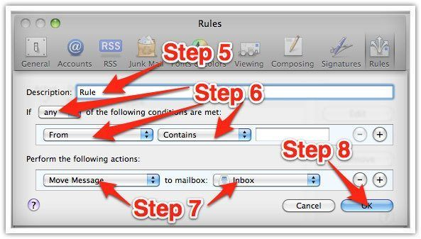

# Gracias por suscribirte

Muchas empresas de correo electrónico e Internet ahora utilizan programas para bloquear correos electrónicos no deseados, a menudo llamado SPAM. A veces, sin embargo, estos programas bloquean correos electrónicos que **sí** deseas recibir.

## Para asegurar que recibas nuestros correos

Asegúrate de agregar las direcciones correspondientes de correo electrónico de [retiratejovenyrico.com](/) a tu lista blanca para garantizar la mejor oportunidad de recibir nuestro contenido y actualizaciones.

Una _lista blanca_ es una lista de direcciones de correo electrónico o nombres de dominio de los que un programa de bloqueo de correo electrónico permitirá que se reciban mensajes.

### ¿Por qué es importante?

El correo electrónico publicitario no solicitado, no deseado, comúnmente conocido como _"spam"_, se ha convertido en un gran problema.

Se ha llegado a tales proporciones que la mayoría de los servicios de correo electrónico y proveedores de servicios de Internet (ISP) han puesto algún tipo de bloqueo o sistema de filtrado o comenzaron a confiar en las auto-proclamadas listas negras para diferenciar los buenos de los malos.

En Retírate Joven y Rico apoyamos esta intención de protegerte del spam, pero todos estamos de acuerdo que los sistemas actuales para detener el spam están lejos de ser una solución perfecta y a menudo bloquean correo electrónico que has solicitado.

Los activistas anti-spam más responsables están trabajando duro para reducir estos "falsos positivos", pero en el ínterin, te puedes encontrar inesperadamente con que no estás recibiendo el contenido de tus suscripciones...

Para evitar estas situaciones, hay algo que puedes hacer para evitar que el contenido de tu suscripción caiga en la falsa trampa positiva.

Puedes luchar contra las listas negras creando una _"lista blanca"_.

### Agréganos a tu lista blanca

Agréganos a tu lista blanca antes de que la entrega de nuestros correos se vea interrumpida.

Por supuesto, cada sistema de correo electrónico es diferente. A continuación se presentan las instrucciones para algunos de los más populares.

Si el tuyo no está aquí, por favor ponte en contacto con la gente de servicio al cliente de tu ISP para obtener instrucciones. (Envíanos la respuesta a nosotros y podríamos agregarla!)

Si estás usando algún tipo de filtro de spam o software de bloqueo tú mismo (además del que tu ISP provee), también hemos enumerado instrucciones sobre cómo eximir tu suscripción de algunos de los más populares de esos programas.

## Gmail

1. ### Buscar correo

   En tu bandeja de entrada, busca un correo electrónico de [alfonso@retiratejovenyrico.com](mailto:alfonso@retiratejovenyrico.com) o [info@retiratejovenyrico.com](mailto:info@retiratejovenyrico.com) (por ejemplo, tu correo de bienvenida que acabas de recibir).

2. ### Arrastrar correo

   Arrastra este correo electrónico a la pestaña **"PRINCIPAL"** o **"PRIMARY"** de tu bandeja de entrada.

   

3. ### ¡Listo!

   Verás que nuestros correos electrónicos irán a tu carpeta principal en el futuro.

## Yahoo Mail

1. Al abrir un mensaje de correo electrónico, debe aparecer un símbolo **_"+"_** junto a **_De:_** y el nombre del remitente.
2. Da click en el **_"+"_** y aparecerá una ventana emergente **_"Agregar a contactos"_**.
3. Selecciona **_"Guardar"_**.

   

## Mac Mail

1. ### Ir a preferencias

   Da click en **_"Mail"_** y luego en la opción **_"Preferences"_** en el menú superior.

   

1. ### Crear regla

   En la ventana **_"Preferences"_**, da clic en el ícono **_"Rules"_**. Luego da clic en el botón **_"Add Rule"_**.

   

1. ### Mover mensaje

   - En la ventana **_"Rules"_**, escribe un nombre para tu regla en el campo **_"Description"_**.
   - Utiliza la configuración siguiente: **_"If any of the following conditions are met: From Contains"_**. Escribe la dirección de correo electrónico del remitente en el campo de texto junto a **_"Contains"_**.
   - Selecciona **_"Move Message"_** e **_"Inbox"_** del menú.
   - Da clic en **_"OK"_** para salvar la regla.

   

## Outlook 2003 y posterior

1. ### Botón derecho

   Haz clic con el botón derecho en el mensaje en tu bandeja de entrada.

2. ### Seleccionar

   Selecciona **_"Correo no deseado"_** en el menú.

3. ### Agregar

   Haz clic en **_"Agregar remitente a lista de remitentes seguros"_**.

   
